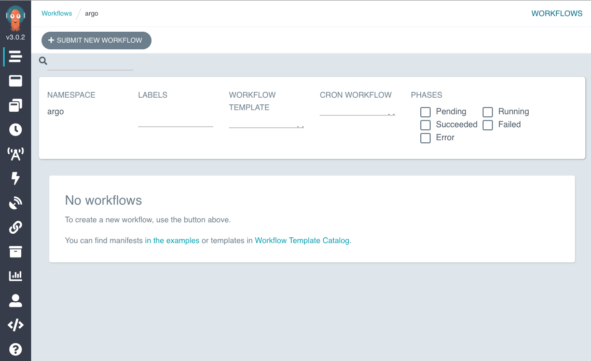
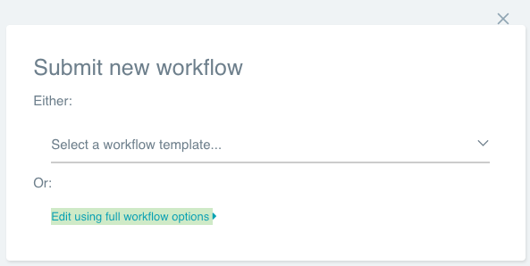
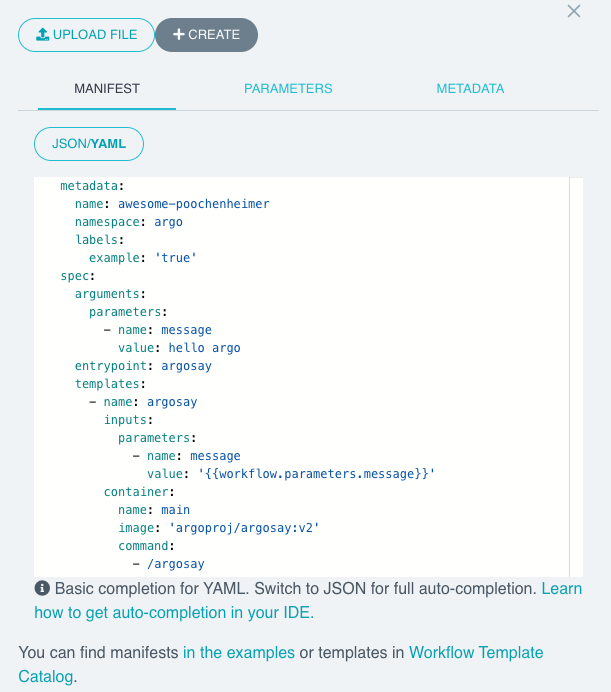
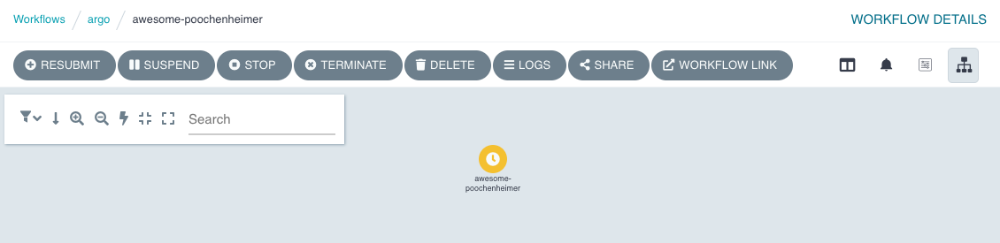
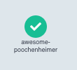

In this scenario you will:

1. Install Argo Workflows into a Kubernetes cluster.
2. Run your first workflow from the user interface.
3. Download, install, and run the Argo CLI.

A workflow is defined as a **Kubernetes resource**. Each workflow consists of one or more templates, one of which is
defined as the entrypoint. Each template can be one of several types, in this example we have one template that is a
container.

```file
manifests/modules/automation/workflows/argo/getting-started/hello-workflow.yaml
```

There are several other types of templates, and we'll come to more of them soon.

Because a workflow is just a Kubernetes resource, you can use `kubectl` with them.

Create a workflow:

```bash
$ kubectl -n argo apply -f ~/environment/eks-workshop/modules/automation/workflows/argo/getting-started/hello-workflow.yaml
```

Then you can wait for it to complete (around 1m):

```bash timeout=120
$ kubectl -n argo wait workflows/hello --for condition=Completed --timeout 2m
```

We need to expose argo-server on LoadBalancer to reach the UI

```bash
$ kubectl expose svc argo-server -n argo --port 80 --target-port 2746 --type LoadBalancer --name argo-server-lb
```

Now get the URL to access UI
```bash
$ echo "Argo URL: http://$(kubectl get svc -n argo argo-server-lb -o jsonpath='{.status.loadBalancer.ingress[0].hostname}')"
```

## Run a workflow

Open the "Argo Server" tab and you should see the user interface:



Lets start a workflow from the user interface:

Click "Submit new workflow":



Click "Edit using full workflow options". You should see something similar to this:



Paste this YAML into the editor:

```yaml
metadata:
  generateName: hello-world-
  namespace: argo
spec:
  entrypoint: main
  templates:
  - name: main
    container:
      image: docker/whalesay
      command: ["cowsay"]
```

Click "Create". You will see a diagram of the workflow. The yellow icon shows that it is pending, after a few seconds it'll turn blue to indicate it is running, and finally green to show that it has completed successfully:



After about 30s, the icon will change to green:



## Exercise

Take a few minutes to play around with the user interface. Find out how to:

* List workflows.
* View a workflow.
* Resubmit a completed workflow.

## Conclusion
Let's recap:

* Argo Workflows is a workflow engine for Kubernetes.
* A workflow is a **Kubernetes resource**, so you can use `kubectl` to manage them.
* The user interface allows you to create and view workflows in a web browser.
* The CLI also allows to create and view workflows, but in the console.

Please [let us know what can be improved](https://github.com/csantanapr/argo-workflows-intro-course/issues).
